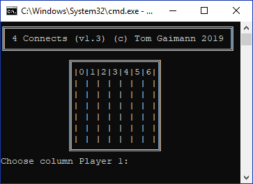
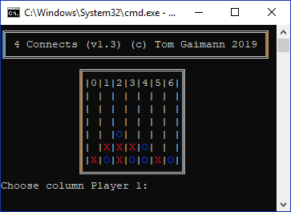

# Vier gewinnt / Four connects
The game itself is pretty self explaining I think.

## Install and run
- Install the requirements:
```
pip install -r requirements.txt
```

- Run:
```
python3 run.py
```

- Get verbose output:
```
python3 run.py -v
```

## Screenshots


